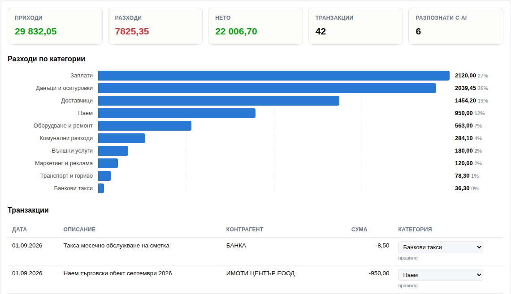

# Анализ на банково извлечение

Качваш CSV експорт от банката. Транзакциите се разпределят по счетоводни категории, виждаш обобщение и графика, и сваляш готов CSV.

**Демо:** https://alex1103bg-coder.github.io/izvlechenie-analiz/
Бутонът „Демо без ключ“ зарежда примерно извлечение, така че да се види как работи без API ключ.

## Основната идея: AI е последната стъпка, не първата

Най-лесното решение е всяка транзакция да се прати на AI. То работи, но е бавно, струва пари и при едни и същи данни може да върне различен резултат.

Затова редът тук е друг:

1. **Научени правила.** Ако този контрагент вече е категоризиран веднъж, използва се същата категория. Без заявка.
2. **Правила по ключови думи.** „наем“, „осигурителни вноски“, „инкасо оборот каса“ и подобни се разпознават локално.
3. **AI само за останалото.** Това, което правилата не покриват — обикновено доставчици с произволни имена.

На примерното извлечение от 42 транзакции правилата покриват 36, а до AI стигат 6. Една заявка вместо 42.

**Поправката става правило.** Смениш ли категория на ред, контрагентът се запомня. Следващия месец същият доставчик се разпознава без AI. Колкото повече се ползва, толкова по-малко пита.

## Какво прави

- Чете CSV с разделител `;`, `,` или табулация — разпознава се автоматично
- Разбира и двата формата за суми: `1 234,56` и `1,234.56`
- Разбира и двете подредби: една колона „Сума“ или отделни „Дебит“ и „Кредит“
- Намира колоните по име, вместо да разчита на фиксирана подредба
- 12 счетоводни категории; ако моделът върне нещо извън списъка, се записва „Друго“
- Обобщение: приходи, разходи, нето, брой транзакции, колко са минали през AI
- Хоризонтална графика на разходите по категории
- **Проверка на сбора:** сумата по категории трябва да е равна на общия разход; разминаване или некатегоризирани редове се показват като предупреждение
- Износ в CSV с колона „Източник“ — правило, AI или ръчно
- Тъмна и светла тема

## Как работи

Един HTML файл, без библиотеки и без бекенд.

CSV-то се чете и парсва в браузъра. Правилата са регулярни изрази. Некатегоризираните редове се пращат на Gemini **на групи по 25**, с `responseSchema` за строг JSON и `temperature: 0`.

Списъкът с модели се тегли от `GET /v1beta/models` при въвеждане на ключа, вместо да е забит в кода.

Научените правила се пазят в `localStorage` на браузъра.

## Какво излезе при тестването

**Правилото за „сервиз“ беше твърде широко.** Първата версия слагаше всичко с думата „сервиз“ в „Оборудване и ремонт“. Така доставчикът на опаковки „МЕТРО ПАК СЕРВИЗ“ се оказа в ремонтите и 166 евро отидоха в грешна категория. Открих го, защото сумата на категорията не съвпадаше с очакваното.

Изводът беше по-общ от самия бъг: **правило, което ловува по една дума от име на фирма, ще бърка.** Стесних го до конкретни изрази, а имената на фирми ги оставих на AI и на научените правила — там им е мястото.

**Затова съществува проверката на сбора.** Ако всяка транзакция получи някаква категория, резултатът винаги изглежда завършен. Сравняването на сбора по категории с общия разход е евтино и хваща тихите грешки.

## Инсталация

Не се инсталира. Отваряш демото, или сваляш `index.html` и `primerno-izvlechenie.csv` в една папка и отваряш HTML-а.

За AI частта трябва безплатен Gemini API ключ от [Google AI Studio](https://aistudio.google.com/apikey). Без ключ приложението пак работи — просто спира след правилата и показва кои редове остават.

**За ключа:** стои само в твоя браузър и се праща единствено към Google. В repo-то няма ключ и не трябва да има.

## За данните

`primerno-izvlechenie.csv` е **измислено** извлечение на несъществуваща фирма. Никакви реални банкови данни.

## Какво липсва

- Не разпознава превод между собствени сметки (би се броил веднъж като приход и веднъж като разход)
- Няма разделяне на една транзакция по няколко категории
- Категориите са фиксирани в кода, не се добавят от интерфейса
- Няма връзка със счетоводен софтуер — изходът е CSV

## Инструменти

HTML, CSS, JavaScript, Gemini API. Кодът е писан с помощта на Claude. Категориите, правилата, архитектурата „правила преди AI“ и тестването са моя работа.
